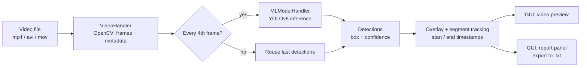

# Violence Detection in Video – Desktop Application

A Python desktop application that analyzes a video file, detects segments containing **violence**, and reports **where in the video** they occur. Built as my internship project at Schneider Electric.

| | |
|---|---|
| **Goal** | Help identify content that is inappropriate for children, with a focus on violence |
| **Input** | Video file (`.mp4`, `.avi`, `.mov`) |
| **Output** | Annotated live preview + list of time segments with detected violence, exportable to `.txt` |
| **Stack** | Python · OpenCV · Ultralytics YOLOv8 (PyTorch) · TensorFlow/Keras (3D CNN experiments) · CustomTkinter |
| **Period / team** | 13 Nov – 3 Dec 2025 (3 weeks), individual project with a mentor |

## Features

- Load a video through a file dialog and analyze it frame by frame
- Violence detection with a YOLOv8 model, drawn as bounding boxes with confidence and timestamp
- Automatic **segment tracking**: start and end time of every detected violent scene (`MM:SS.cc`), including a scene that lasts until the end of the video
- Live report panel and **export to a `.txt` file**
- Playback speed control (0.25x – 1.5x) and a Restart button
- Responsive GUI: video processing runs in a background thread, the interface is updated safely through the main thread
- Works with both horizontal and vertical videos (frames are scaled to fit the display area)

## Architecture



| File | Responsibility |
|---|---|
| `main.py` | GUI (CustomTkinter), worker thread with the processing loop, timestamp formatting, segment logic, report export |
| `video_handler.py` | Thin wrapper around `cv2.VideoCapture`: opening the video, metadata (FPS, frame count, resolution, duration), reading frames, current frame index and timestamp |
| `ml_model_handler.py` | Loads the YOLOv8 weights and returns violence detections (box + confidence) for a single frame |

### Key parameters

| Parameter | Value | Why |
|---|---|---|
| Confidence threshold | `0.8` | At `0.6` there were too many false positives on harmless videos |
| IoU (NMS) | `0.5` | Avoid multiple boxes on the same object |
| Detection interval | every 4th frame | Real-time speed; last detections are reused in between |
| Violence class ID | `1` | Class index in the model that was used |

## Installation

Requires Python 3.10+.

```bash
git clone <repo-url>
cd <repo-folder>

python -m venv venv
venv\Scripts\activate          # Windows
# source venv/bin/activate     # Linux / macOS

pip install -r requirements.txt
```

### Model weights

Model files are not stored in the repository (see `.gitignore`). Download the YOLOv8-small weights of [`Musawer14/fight_detection_yolov8`](https://huggingface.co/Musawer14/fight_detection_yolov8) from Hugging Face (MIT license) and place them here:

```
models/yolo_small_weights.pt
```

The model has two classes, *Violence/Fight* and *NoViolence/NoFight*.

## Usage

```bash
python main.py
```

1. Click **Load Video** and choose a file.
2. The video is played and analyzed at the same time. Detected violence is marked with a red box, and the report panel on the right fills up with segments.
3. Adjust playback speed with the slider on the right, or click **Restart** to analyze the same video again.
4. Click **Sačuvaj izveštaj (.txt)** to export the report.

> The interface and the report are in Serbian.

### Example report

Format of the exported report (values are illustrative):

```
Izveštaj za: sample.mp4
NASILJE! Pouzdanost: 0.87
Početak: 00:12.40 / Kraj detekcije: 00:18.75
```

## How the model was chosen

The task required a pretrained model for violence detection, so choosing and evaluating one was a large part of the project.

**1. Research.** Candidates considered: torchvision 3D CNNs (`r3d_18`, `r2plus1d_18`, `mc3_18`, Kinetics-pretrained), a Keras 3D CNN for fight detection, and YOLOv8 nano/small fight detection models. Models were compared by required input, pre-processing, framework, license and the data they were trained on.

**2. YOLOv8-small.** Frame-level object detector, returns a bounding box and confidence per frame. First model integrated.

**3. 3D CNN (branch `feature/3dcnn-model2`).** Keras `Sequential` model with `Conv3D` / `MaxPooling3D` layers, `GlobalAveragePooling3D` and a 2-class softmax. Input: a sliding window of 64 frames, 224×224 RGB, normalized to [0, 1]. The base model was trained on the *Real Life Violence Situations* dataset (Kaggle).

**4. Fine-tuning experiment.** After finding false positives, I fine-tuned the 3D CNN: all layers frozen except the last 4 (classification head), lower learning rate, and a new hand-collected dataset with both Fight and NonFight clips, focused on "hard negatives" (energetic but harmless actions: hip-hop, breakdance, zumba, athletics, falls, group hugs, jumping jacks, wood chopping), extended with augmentation (mirroring, color/brightness changes, cutting long clips into shorter ones).

### Evaluation

Models were evaluated **manually** on a set of real and animated videos (roughly 100–200 videos), watching where each model reports a fight. No precision/recall was computed.

| Observation | YOLOv8-small (threshold 0.8) | 3D CNN | 3D CNN after fine-tuning |
|---|---|---|---|
| Energetic but harmless motion (hip-hop, jumping jacks, wood chopping, falls) | Mostly correct, with some false positives on solo dance and falls | Frequent false positives, up to 0.95 confidence | Still false positives, up to 1.00 confidence |
| Boxing matches | Mixed (depends on camera angle) | Not detected | – |
| Street/hockey fights | Detected | Detected on sudden movement, then often corrected to NonFight | – |
| Animated content | Some detections, low confidence (0.5–0.8) | Weak | – |
| Low-quality (surveillance) video | Missed | More false positives on fast movement | – |

**Findings**

- YOLOv8 reacts to **facial expressions** (wide eyes, open mouth), **body posture** (bent over, kneeling, outstretched arms) and fast motion. Weapons are mostly not recognized.
- The 3D CNN confuses **chaotic movement with aggression** and misses structured fights such as boxing.
- Lowering the YOLO threshold from 0.8 to 0.6 produced many false positives, so 0.8 is used.
- Fine-tuning on a small dataset did not remove the 3D CNN false positives in my tests.

**Decision.** The final application uses **YOLOv8-small**: it produced fewer false positives on harmless dynamic content, and its per-frame boxes and timestamps map directly to the required segment report.

### Performance

Frame skipping (detection on every 4th frame) gave a clear speed-up. Downscaling the frames before inference to 320×320 / 480×480 did not, since YOLO rescales its input internally (the `imgsz` prediction parameter controls that).

## Limitations and future work

- Detection is performed while the video plays, so analysis time follows playback speed. A batch mode that processes the whole file as fast as possible would be a natural next step.
- Segments are closed as soon as a checked frame has no detection. Merging detections that are close in time (e.g. within 1–2 seconds) would give cleaner reports.
- Known weak spots of the model: bent/kneeling postures, sudden movements (breakdance, falls) and facial expressions of fear; boxing from unusual camera angles and low-resolution footage are missed.
- Larger and more diverse training data (real structured fights, harmless chaotic movement, surveillance footage) is needed for the model to learn the context, not only the movement.
- The report can be exported only as plain text. Adding CSV / JSON would make results easier to process further.

## My contribution

I worked on this project on my own, with a mentor who defined the task and reviewed my progress. I:

- researched and compared pretrained models (YOLOv8, 3D CNN) and integrated them into the application;
- built the video-processing layer with OpenCV and the desktop GUI (video preview, playback controls, live report, export);
- implemented detection of violent segments with start and end timestamps, and sped up analysis with frame skipping and a background worker thread;
- fine-tuned the 3D CNN on a custom, augmented dataset and evaluated all approaches on roughly 100–200 real and animated videos;
- organized the work in Git (one branch per approach) and wrote the documentation and the test report.

## Acknowledgements

- YOLOv8 fight detection model: [Musawer14/fight_detection_yolov8](https://huggingface.co/Musawer14/fight_detection_yolov8) (MIT)
- 3D CNN base model: [Musawer14/fight_detection_3DCNN](https://huggingface.co/Musawer14/fight_detection_3DCNN)
